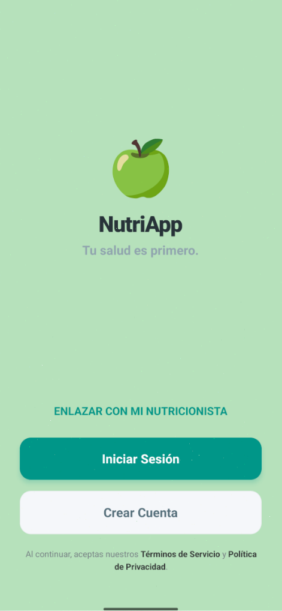
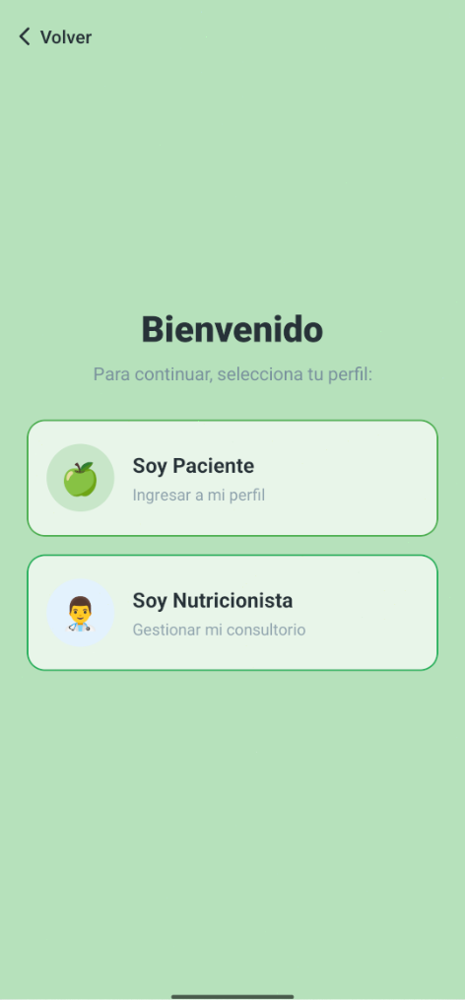
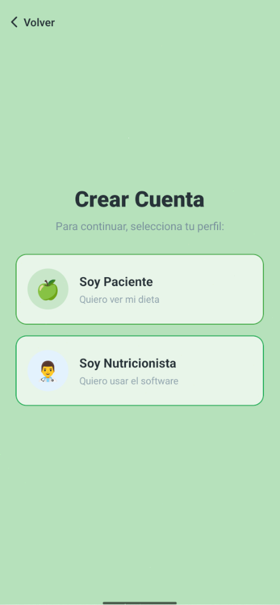
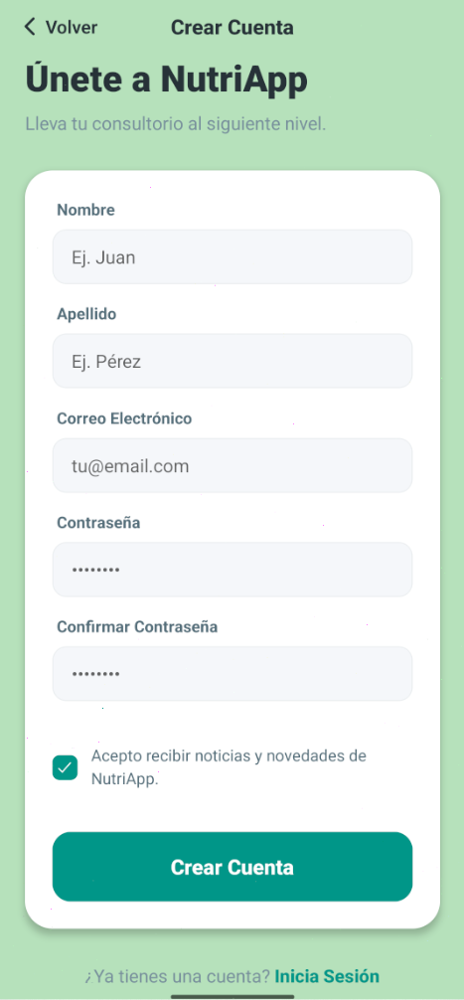
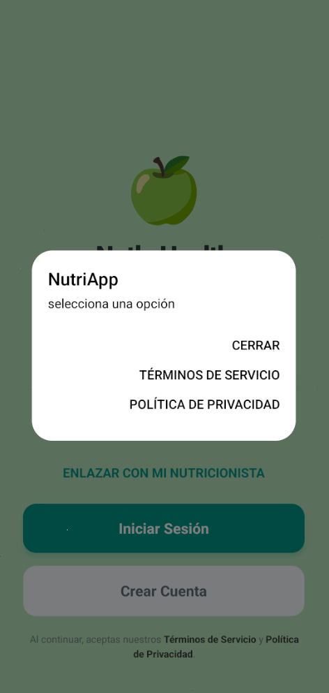
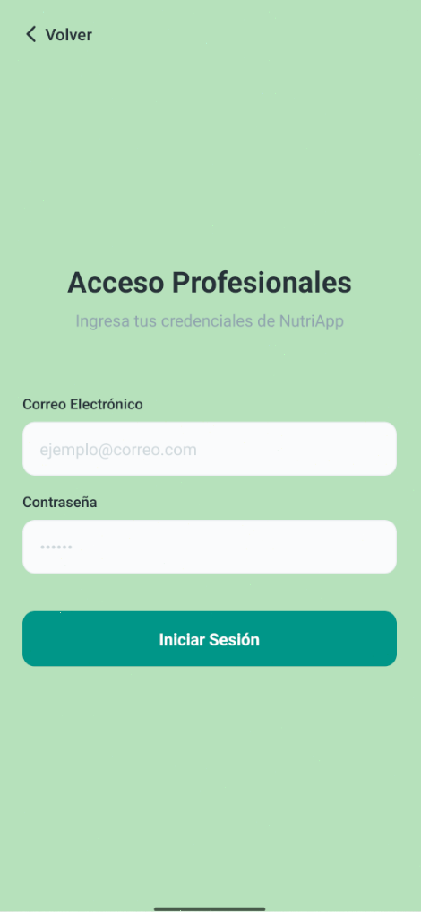
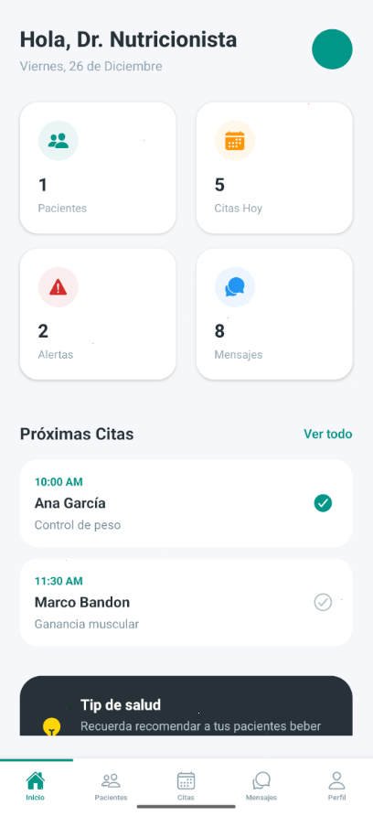
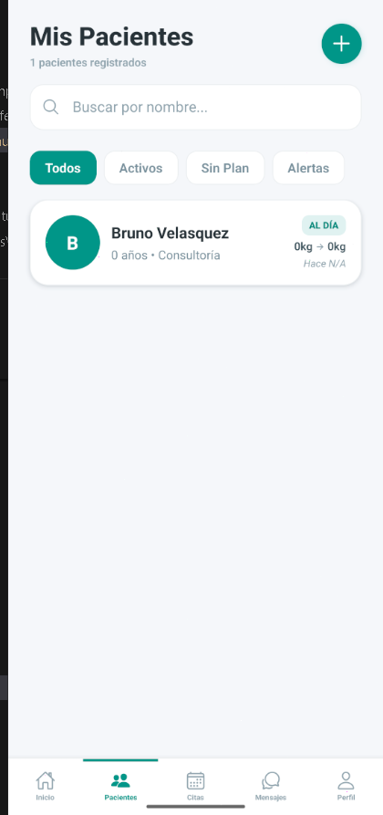
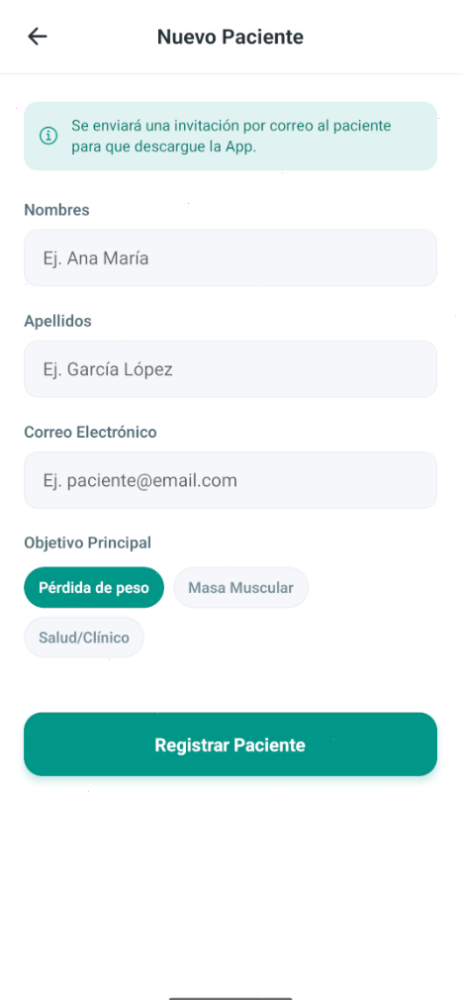
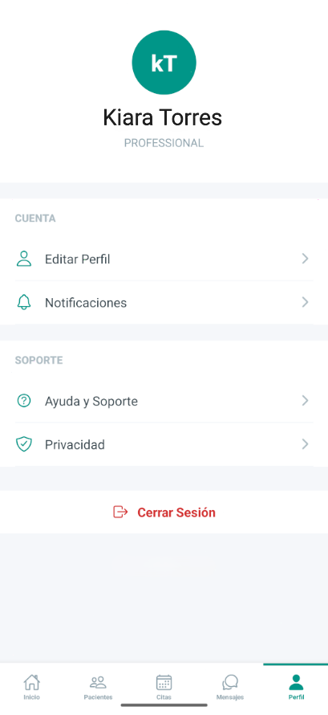

# NutriApp

Bienvenido a NutriApp — una solución para la gestión nutricional que incluye un backend en Django y una app móvil construida con Expo + React Native (TypeScript).

---

## � Pantallas de la App

Aquí puedes ver las pantallas principales que ya están implementadas. El flujo fue diseñado para ser intuitivo tanto para profesionales (nutricionistas) como para pacientes.

| Pantalla | Descripción |
|----------|-------------|
|  | **Landing Screen** — Pantalla Inicial de NutriApp |
|  | **Welcome Screen** — Bienvenida con acceso rápido a login/registro |
|  | **Register** — Registro de usuario seleccionar Rol |
|  | **Register Professional** — Registro específico para nutricionistas |
|  | **Terms & Services** — Ver términos y condiciones |
|  | **Login** — Inicio de sesión con JWT automático |
|  | **Professional Home** — Dashboard para nutricionistas con tabs (Pacientes, Calendario, etc.) |
|  | **Patient List** — Listado de pacientes con búsqueda y botón agregar |
|  | **Add Patient** — Agregar Paciente, ingresar datos y guardar |
|  | **Professional Profile** — Perfil del profesional con datos y especialidades |

---

## 🔎 Resumen 
- **Backend:** Django REST Framework (arquitectura por apps en `apps/`).
- **Móvil:** Expo + React Native + TypeScript con organización por features (`core`, `domain`, `features`, `navigation`, `shared`).
- **Infra / Dev:** Docker Compose para desarrollo, PostgreSQL como DB, OpenAPI (drf-spectacular) para documentación automática.

---

## 🏗️ Arquitectura & Tecnologías
**Arquitectura general:** el repo es monolítico pero modular: cada feature del backend vive en su propia app Django (`users`, `nutrition`, `clinical`) y la app móvil sigue un patrón por capas y responsabilidades para facilitar pruebas y mantenibilidad.

**Tecnologías clave:**
- Backend: **Python**, **Django**, **Django REST Framework**, **drf-spectacular** (OpenAPI)
- Autenticación: **JWT** con `djangorestframework-simplejwt`
- Móvil: **Expo**, **React Native**, **TypeScript**
- DB / Infra: **PostgreSQL**, **Docker Compose**
- Almacenamiento de secretos: variables de entorno (ver `.env.example`)

---

## ✨ Qué vas a encontrar en este README
1. **Pantallas de la UI** (screenshots de lo que ya existe)
2. **Interfaces TypeScript** utilizadas por la app móvil (contratos con el backend)
3. **Endpoints del backend** con descripciones y ejemplos
4. Breve **mapa de modelos** principales (para entender payloads)
5. Cómo ejecutar el proyecto localmente y dónde está la documentación automática

---

## 🧩 Tipos & Interfaces (TypeScript)
A continuación se muestran las interfaces públicas que usa la app móvil. Todos los contratos TypeScript están en [nutri-mobile/src/domain](nutri-mobile/src/domain) y [nutri-mobile/src/core](nutri-mobile/src/core).

### Autenticación
**`IAuthResponse`** — respuesta del endpoint de login
```typescript
{
  refresh: string;        // Token para refrescar el access
  access: string;         // JWT principal (incluir en headers)
  token?: string;         // Alternativo (algunos backends usan esto)
  user?: any;             // Objeto usuario (si viene)
}
```

### Usuarios
**`IUser`** — representación de usuario en la app
```typescript
{
  id: string;             // UUID
  email: string;
  first_name: string;
  last_name: string;
  role: 'ADMIN' | 'ORG_OWNER' | 'PROFESSIONAL' | 'PACIENTE';
  organization?: string;  // ID de la clínica/organización
  photo?: string;         // URL de la foto
}
```

### Gestión Clínica
**`IPatient`** — expediente clínico de un paciente
```typescript
{
  id: string;             // UUID
  first_name: string;
  last_name: string;
  email: string;
  is_active: boolean;
  phone?: string;
  photo?: string;         // Foto del perfil
  app_user_id?: string | null;  // Vinculación con usuario de app (UUID o null si no existe)
  status_label?: string;  // "Vinculado" o "Pendiente"
}
```

### Nutrición
**`IFood`** — ingrediente/alimento base
```typescript
{
  id: string;
  name: string;
  calories: number;       // kcal por 100g
  proteins: number;       // gramos
  carbs: number;          // gramos
  fats: number;           // gramos
  fiber?: number;         // gramos (opcional)
}
```

**`INutrientData`** — valores nutricionales agregados
```typescript
{
  calories: number;
  proteins: number;
  carbs: number;
  fats: number;
}
```

**`IMeal`** — receta/plato
```typescript
{
  id: string;
  name: string;           // Ej: "Pechuga con Brócoli"
  description?: string;
  items: IDietItem[];     // Array de ingredientes con cantidades
  total_calories?: number; // Calculado por backend
}
```

**`IDietItem`** — ingrediente dentro de una receta
```typescript
{
  id: string;
  quantity_grams: number; // Ej: 150
  portion_display?: string; // Ej: "1 pechuga" (visualización)
  is_flexible?: boolean;
  food: IFood;            // Objeto del alimento
}
```

**`IDietPlan`** — plan nutricional completo
```typescript
{
  id: string;
  name: string;           // Ej: "Plan Hipertrofia - Semana 1"
  start_date: string;     // ISO 8601
  end_date?: string;
  kcal_target?: number;   // Objetivo calórico diario
  is_flexible_global?: boolean;
  meals: IMeal[];         // Árbol de comidas del plan
}
```

### Almacenamiento
**`StorageInterface`** — abstracción para guardar datos locales
```typescript
{
  setItem(key: string, value: string): Promise<void>;
  getItem(key: string): Promise<string | null>;
  removeItem(key: string): Promise<void>;
}
```

> Las interfaces están tipadas con TypeScript para garantizar consistencia entre frontend y backend. Úsalas como referencia al crear requests o parsear responses.

---

## 🔗 Endpoints del Backend (API)
La API raíz está montada bajo `/api/`. La documentación viva está siempre en `/api/docs/` (Swagger UI) — ese es el lugar correcto para probarlos.

### 🔐 Autenticación (JWT)
```
POST /api/login/
  Request:  { "email": "user@example.com", "password": "..." }
  Response: { "access": "eyJ...", "refresh": "eyJ..." }

POST /api/refresh/
  Request:  { "refresh": "eyJ..." }
  Response: { "access": "eyJ..." }
```

### 👥 Usuarios (`/api/users/`)
```
GET    /api/users/
       → Lista usuarios (filtrados por org del usuario logueado)
       Headers: Authorization: Bearer <access_token>

POST   /api/users/
       Request:  { "email": "...", "first_name": "...", "role": "PROFESSIONAL", "organization": "uuid" }
       Response: { "id": "uuid", "email": "...", ... }

GET    /api/users/{id}/
       → Detalle de usuario específico

PUT/PATCH /api/users/{id}/
       → Actualizar usuario (algunos campos son read-only)

DELETE /api/users/{id}/
       → Eliminar usuario
```

**Permisos:**
- ADMIN: ve todos los usuarios
- ORG_OWNER: ve usuarios de su organización
- PROFESSIONAL/PACIENTE: solo ve su propio perfil

### 🥗 Nutrición (`/api/nutrition/`)
```
GET    /api/nutrition/ingredients/
       → Catálogo de ingredientes (solo lectura)
       Response: [{ "id": "uuid", "name": "Pechuga", "calories": 165, ... }]

GET    /api/nutrition/meals/
       → Recetas (filtradas por creador o acceso)
       Response: [{ "id": "uuid", "name": "Pechuga con Brócoli", "meal_items": [...] }]

POST   /api/nutrition/meals/
       Request:  { "name": "Mi Receta", "description": "...", "meal_items": [...] }
       Response: { "id": "uuid", ... }

GET    /api/nutrition/diet-plans/
       → Planes nutricionales (filtrados por rol: profesional ve los que creó, paciente los asignados)
       Response: [{ "id": "uuid", "name": "Plan 1", "allocations": [...] }]

POST   /api/nutrition/diet-plans/
       Request:  { "patient": "uuid", "professional": "uuid", "name": "Plan", "is_active": true }
       Response: { "id": "uuid", ... }
```

### 🏥 Gestión Clínica (`/api/clinical/`)
```
GET    /api/clinical/patients/
       → Lista de expedientes clínicos (con búsqueda por nombre/email)
       Query params: ?search=juan
       Response: [{ "id": "uuid", "first_name": "Juan", "email": "...", "app_user_id": "uuid|null" }]

POST   /api/clinical/patients/
       Request:  { "first_name": "Juan", "last_name": "Pérez", "email": "juan@example.com", "phone": "+51..." }
       Response: { "id": "uuid", "first_name": "Juan", ... }

GET    /api/clinical/patients/{id}/
       → Detalle completo del expediente

PUT/PATCH /api/clinical/patients/{id}/
       → Actualizar datos del expediente

DELETE /api/clinical/patients/{id}/
       → Eliminar expediente
```

**Permisos:**
- Solo PROFESSIONAL y ORG_OWNER pueden acceder
- Los datos se filtran por organización (multi-tenant)

### 📖 Documentación OpenAPI
```
GET    /api/schema/
       → Descarga el schema en JSON/YAML

GET    /api/docs/
       → Swagger UI interactiva (interfaz de prueba bonita)

GET    /api/redoc/
       → ReDoc UI alternativa (con búsqueda)
```

---

## 📦 Esquemas (Serializers del Backend)

Estos son los esquemas de datos que devuelve la API (para entender qué campos esperar).

### User Response
```json
{
  "id": "f47ac10b-58cc-4372-a567-0e02b2c3d479",
  "email": "juan@example.com",
  "first_name": "Juan",
  "last_name": "Pérez",
  "role": "PROFESSIONAL",
  "photo": "https://cdn.example.com/users/juan.jpg",
  "organization": "org-uuid",
  "organization_data": {
    "id": "org-uuid",
    "name": "Clínica Central",
    "plan_type": "PLUS",
    "max_patients": 50,
    "allows_branding": true,
    "support_level": "Chat"
  },
  "professional_profile": {
    "license_number": "NUT-2024-1234",
    "bio": "Nutricionista especializada en deporte",
    "specialties": ["Hipertrofia", "Peso"]
  },
  "created_at": "2024-01-15T10:30:00Z"
}
```

### ClinicalPatient Response (List)
```json
{
  "id": "patient-uuid",
  "first_name": "Carlos",
  "last_name": "López",
  "email": "carlos@example.com",
  "is_active": true,
  "app_user_id": "user-uuid-or-null",
  "status_label": "Vinculado",
  "initials": "CL",
  "photo": "https://cdn.example.com/patients/carlos.jpg"
}
```

### Meal Response (Completo)
```json
{
  "id": "meal-uuid",
  "name": "Pechuga con Brócoli",
  "description": "Cocinar a la plancha con sal",
  "total_calories": 250.5,
  "meal_items": [
    {
      "id": "item-uuid",
      "ingredient": "ingredient-uuid",
      "quantity_grams": 150,
      "calories_contribution": 247.5,
      "ingredient_details": {
        "name": "Pechuga de Pollo",
        "calories": 165,
        "proteins": 31,
        "carbohydrates": 0,
        "fats": 3.6
      }
    }
  ]
}
```

### DietPlan Response
```json
{
  "id": "plan-uuid",
  "name": "Plan Hipertrofia - Semana 1",
  "description": "Enfocado en ganancia de masa muscular",
  "patient": "patient-uuid",
  "professional": "professional-uuid",
  "is_active": true,
  "allocations": [
    {
      "id": "allocation-uuid",
      "day_of_week": 1,
      "meal_time": "BREAKFAST",
      "meal": "meal-uuid",
      "notes": "Acompañar con café",
      "meal_details": { ... }
    }
  ],
  "created_at": "2024-01-15T10:30:00Z"
}
```

---

## 🧾 Modelos principales (campos relevantes)
Esto ayuda a entender qué contienen los recursos que devuelve la API.

### User (Usuarios)
- `id` (UUID) — Identificador único
- `email` — Email único (usado para login)
- `first_name`, `last_name` — Nombre completo
- `role` — ADMIN, ORG_OWNER, PROFESSIONAL, PACIENTE
- `organization` (FK) — Clínica a la que pertenece (null para ADMIN)
- `photo` — URL de foto de perfil
- `is_active`, `is_staff` — Control de acceso
- `cognito_sub` (opcional) — Para integración con AWS Cognito

### Organization (Clínicas)
- `id` (UUID), `name`, `slug` — Identificador único y slug para URLs
- `plan_type` — STUDENT | BASE | PLUS | ELITE | ENTERPRISE
- `subscription_end` — Fecha de vencimiento del plan
- `max_patients` — Límite de pacientes (calculado según plan)
- `allows_branding`, `allows_marketplace` — Features según plan
- `support_level` — Email, Chat, WhatsApp VIP

### ClinicalPatient (Expedientes Clínicos)
- `id` (UUID) — Identificador del expediente
- `first_name`, `last_name`, `email`, `phone` — Datos del paciente
- `photo` — Foto del perfil del paciente
- `organization` (FK) — Clínica propietaria (multi-tenant)
- `app_user` (FK nullable) — Vinculación automática con usuario de app
- `is_active` — Estado del tratamiento
- `created_at`, `updated_at` — Auditoría

### Ingredient (Ingredientes)
- `id`, `name` — Nombre único del alimento
- `category` — PROTEIN, CARB, FAT, VEGETABLE, FRUIT, DAIRY, OTHER
- `calories` — kcal por 100g
- `proteins`, `carbohydrates`, `fats` — Macros por 100g
- `fiber` — Fibra (g)

### Meal (Recetas)
- `id`, `name`, `description` — Receta y sus instrucciones
- `created_by` (FK) — Nutricionista que la creó (o null si es del sistema)
- `image` — Foto del plato
- `meal_items` — Array de ingredientes con cantidades
- `total_calories` — Calculado del sumatorio de ingredientes

### MealItem (Ingrediente en una Receta)
- `id` — Identificador del item
- `meal` (FK) — La receta a la que pertenece
- `ingredient` (FK) — Qué ingrediente
- `quantity_grams` — Cantidad exacta
- `calories_contribution` — Calculado (macros * gramos / 100)

### DietPlan (Planes Nutricionales)
- `id`, `name`, `description` — Identificación y objetivo
- `patient` (FK) — A quién va dirigido
- `professional` (FK) — Quién lo creó
- `is_active` — Si está en uso
- `allocations` — Array con las comidas asignadas por día
- `created_at`, `updated_at` — Auditoría

### PlanAllocation (Comida Asignada en el Plan)
- `id` — Identificador
- `plan` (FK) — A qué plan pertenece
- `day_of_week` — Lunes (1) a Domingo (7)
- `meal_time` — BREAKFAST, LUNCH, DINNER, etc.
- `meal` (FK) — Qué receta se asigna
- `notes` — Notas particulares (ej: "Tomar con mucha agua")


---

## 🚀 Cómo correr localmente (rápido)
- Backend: ir a `nutri-backend/` y revisar `README.md` que contiene pasos para entorno virtual, migraciones y variables de entorno. También encontrarás `docker-compose.yml` para levantar PostgreSQL y el backend en conjunto.
- Móvil: desde `nutri-mobile/` ejecutar:
  - `npm install`
  - `npx expo start`

---

## 📚 Buenas prácticas y notas
- La API aplica **multi-tenant**: ten cuidado con la visibilidad de datos entre organizaciones.
- La documentación Swagger en `/api/docs/` es la referencia más viva — úsala para probar endpoints.

---
